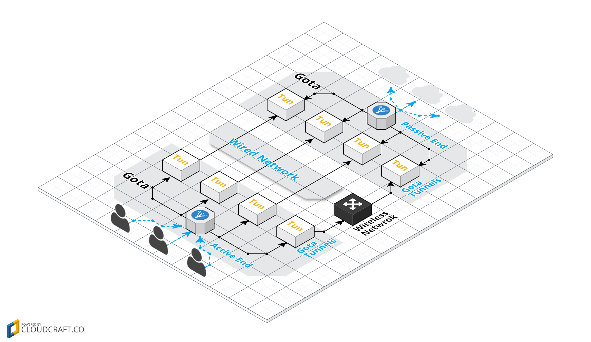

# [WIP] Gota - a TCP Traffic Aggregator Written in Golang

Gota is a userspace multipath tcp solution.

Gota Active End(aka client) receives tcp traffic and forwards to Gota Passive End(aka server) use multipath tcp connections.

## Usage Scenario

Sometimes, our network administrator enables rate-limiting for every tcp connection, the speed of our tcp connections can't reach the top. But if we create multi tcp connections, the traffic of all connections can be aggregated to reach the top speed.

## Quick Start

We can use Gota as a library, client or server.

## Architecture

## Contributing

Contributions are welcome.

## Copyright / License

Copyright 2013-2017 Jim Ma

This software is licensed under the terms of the Apache License Version 2. See the [LICENSE](./LICENSE) file.

